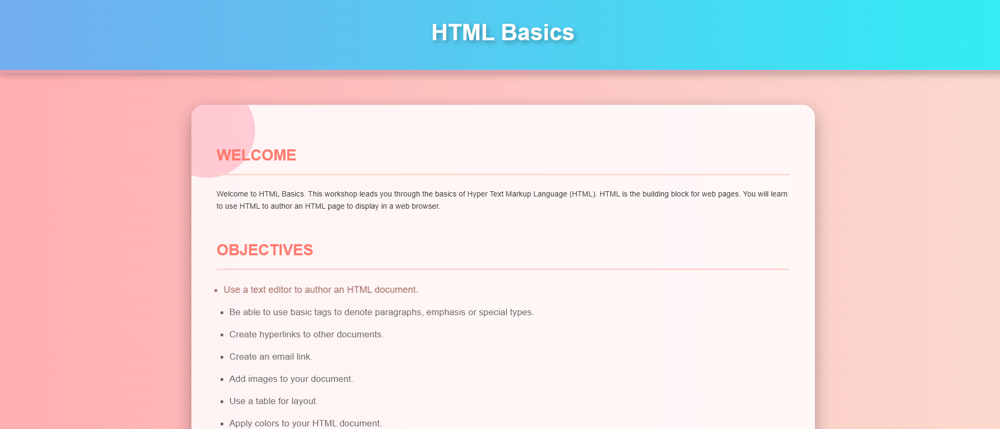
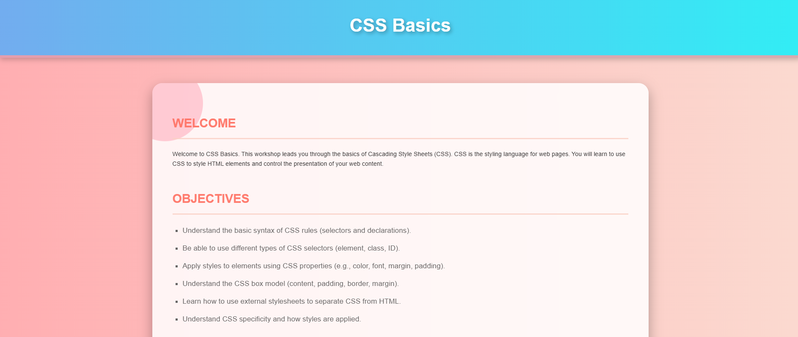
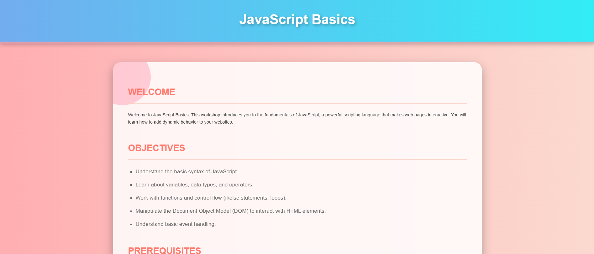
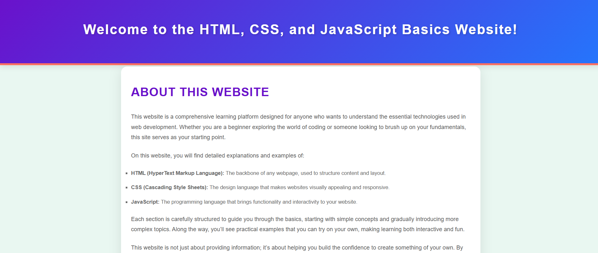

# 🌐 Basic Web Development Tutorial Website


> A beginner-friendly website introducing HTML, CSS, and JavaScript fundamentals, designed with clean responsive layouts, smooth navigation, and interactive resources.

---

## 🚀 Live Demo

👉 [Live Website](https://niloytalukdar.github.io/basicwebdev/)

---

## 📸 Project Preview

### 🏠 Homepage


### 🛠️ HTML Basics Page


### 🎨 CSS Basics Page


### 🧠 JavaScript Basics Page


### 👨‍💻 About Page


---

## 🌟 Features

- 📖 Basic introduction to HTML, CSS, and JavaScript
- 🧩 Separate pages for each technology
- 🎨 Stylish UI with gradients, hover effects, and responsiveness
- 🎬 Quick access to learning videos and articles
- 📱 Mobile-friendly design with media queries
- 🖱️ Smooth interactive sidebar navigation
- 🔗 External learning resource links (YouTube, GeeksforGeeks)

---

## 🛠️ Tech Stack

| Layer       | Technologies     |
|-------------|------------------|
| Frontend    | HTML5, CSS3, JavaScript |
| UI Design   | Custom CSS animations, Font Awesome Icons |
| Hosting     | (Optional) GitHub Pages, Netlify, Vercel |

---

## 📁 Folder Structure

```bash
basic-webdev-tutorial/
├── index.html
├── HTML.html
├── CSS.html
├── JAVASCRIPT.html
├── ABOUT.html
│
├── style.css
├── style2.css
├── style3.css
│
├── web.png        # Background image
├── images/
│   ├── screenshot_homepage.png
│   ├── screenshot_html.png
│   ├── screenshot_css.png
│   ├── screenshot_javascript.png
│   ├── screenshot_about.png
```

---

## ⚙️ Getting Started

### 📌 Prerequisites
- Modern browser (Chrome, Firefox, Edge)
- Code editor (VS Code, Sublime Text)


or simply open `index.html` in your browser.

---

## 🌍 Deployment

You can easily deploy your site using:
- GitHub Pages
- Netlify
- Vercel
- Firebase Hosting


## 🔐 License

This project is licensed under the [MIT License](LICENSE).

---

## 📬 Contact

- 📧 Email: [your-email@example.com](mailto:your-email@example.com)
- 🔗 LinkedIn: [https://linkedin.com/in/yourprofile](https://linkedin.com/in/yourprofile)

---
